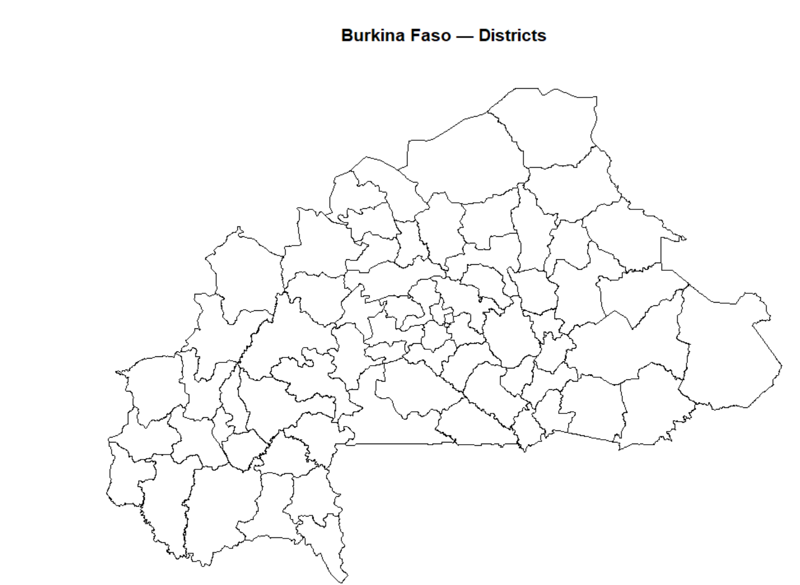
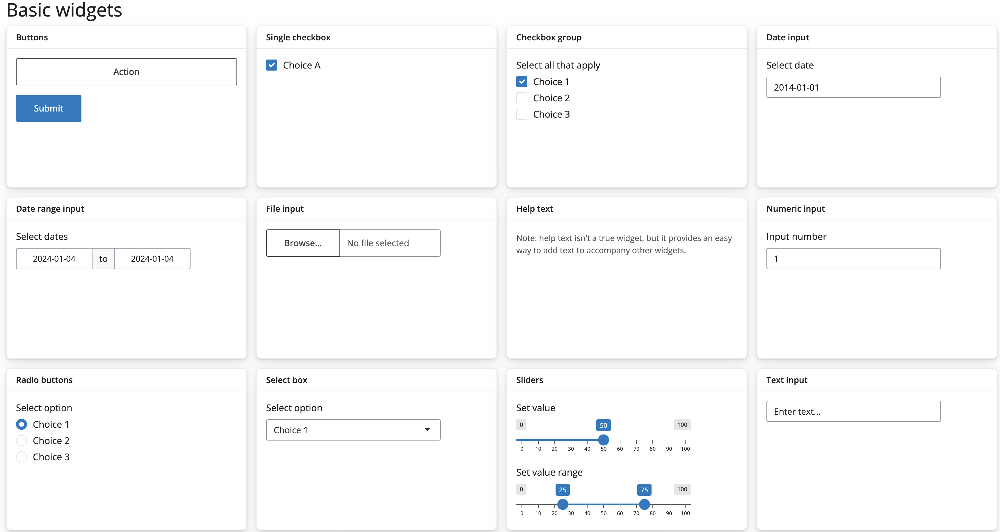

## Setup

### Create a project folder

Before writing any code, set up a clean project 
structure in RStudio:

`File → New Project → New Directory → New Project`

Name it `malaria-shiny-hackathon` and choose a 
sensible location on your computer.

Your project should have the following structure:

```
malaria-shiny-hackathon/
├── app.R          ← your Shiny app (create this)
├── data/          ← provided datasets go here
└── www/           ← logo and images go here
```

### Required packages

Run this once in your console to install any 
missing packages:

```{r}
#| eval: false
pkgs <- c("shiny", "bslib", "tidyverse",
          "leaflet", "sf", "plotly",
          "DT", "bsicons", "scales")

install.packages(
  pkgs[!pkgs %in% rownames(installed.packages())]
)
```

Then load them at the top of every session:

```{r}
#| eval: false
library(shiny)
library(bslib)
library(tidyverse)
library(leaflet)
library(sf)
library(plotly)
library(DT)
library(bsicons)
library(scales)
```

### Training dataset

For this session you will use a pre-prepared dataset 
for **Burkina Faso** covering 2020–2023. The dataset 
uses the real Burkina Faso district shapefile from 
the Malaria Atlas Project, with simulated malaria 
and intervention indicators that reflect realistic 
epidemiological patterns for the country.

::: callout-important
## Download the training data
Download the three `.rds` files from the link below 
and save them into your project's `data/` folder 
before starting:

📁 **[Download training data](#)**

Your `data/` folder should contain:

- `malaria_data.rds` — monthly data for all districts
- `annual_summary.rds` — annual KPI summaries
- `bfa_districts.rds` — Burkina Faso district shapefile
:::

### Load the data

At the top of your `app.R`, after loading packages, 
add:

```{r}
#| eval: false
# load training datasets
malaria_data <- readRDS("data/malaria_data.rds")
annual_df    <- readRDS("data/annual_summary.rds")
district_shp <- readRDS("data/bfa_districts.rds")
```

### Quick data check

Run this in your console to confirm everything 
loaded correctly:

```{r}
#| eval: false
# monthly data
glimpse(malaria_data)

# how many districts and years?
cat("Districts:", n_distinct(malaria_data$district), "\n")
cat("Regions:",   n_distinct(malaria_data$region),   "\n")
cat("Years:",     unique(malaria_data$year),          "\n")
cat("Months:",    unique(malaria_data$month),         "\n")

# shapefile check
plot(sf::st_geometry(district_shp),
     main = "Burkina Faso — Districts")
```

You should see:

- **45 districts** across **13 regions**
- **4 years** × **12 months** = 2,160 rows per district
- A map of Burkina Faso districts



::: callout-note
## About this dataset
The shapefile is real — downloaded from the 
Malaria Atlas Project using the `malariaAtlas` 
R package. The incidence, rainfall, and ITN 
coverage values are simulated to reflect realistic 
epidemiological patterns for Burkina Faso:

- Higher burden in the south and southwest 
  (wetter, higher transmission)
- Lower burden in the north and Sahel 
  (drier, lower transmission)
- Rainfall peaks July–August (Sahel wet season)
- Malaria incidence peaks September–October 
  (6-week lag behind rainfall)
- ITN coverage improves gradually 2020–2023
:::

## What is Shiny?

Shiny is an R package developed by Posit (formerly RStudio) that lets you build interactive web applications directly from R — no HTML, CSS, or JavaScript knowledge required.

### Why Shiny for malaria data?

Malaria programmes generate large volumes of subnational data — district-level incidence, rainfall, intervention coverage, health facility access. Static plots and reports are useful but limited: they show one view, fixed at the time of rendering.

Shiny changes that. Instead of sending a programme manager a PDF with 50 district plots, you give them a dashboard where they can:

- Select their district and year
- Explore trends interactively
- Zoom into the map
- Download the data they need

This is the kind of tool we are building today.

### What does a Shiny app look like?

At its simplest, a Shiny app is a single file called `app.R` that lives in its own folder. It has three parts:

::: callout-note
## The three parts of every Shiny app

**1. UI (User Interface)** Defines what the user *sees* — the layout, input controls (dropdowns, sliders), and placeholders for outputs (maps, plots, tables).

**2. Server** Defines what the app *does* — filters data, builds plots, computes summaries, and sends results back to the UI.

**3. shinyApp()** The function that ties UI and server together and launches the app.
:::

Here is the simplest possible Shiny app:

```{r}
#| eval: false
library(shiny)

# 1. UI — what the user sees
ui <- fluidPage(
  titlePanel("My first Shiny app"),
  
  sidebarLayout(
    sidebarPanel(
      sliderInput(
        inputId = "bins",
        label   = "Number of bins:",
        min = 1, max = 50, value = 30
      )
    ),
    mainPanel(
      plotOutput("histogram")
    )
  )
)

# 2. Server — what the app does
server <- function(input, output, session) {
  
  output$histogram <- renderPlot({
    hist(faithful$waiting, 
         breaks = input$bins,
         col    = "steelblue",
         main   = "Waiting times",
         xlab   = "Minutes")
  })
  
}

# 3. Launch the app
shinyApp(ui, server)
```

::: callout-tip
## Try it now

Copy the code above into a new `app.R` file, save it, and click **Run App** in RStudio. Move the slider watch the histogram update instantly. That is reactivity in action.
:::

### The UI / server conversation

The UI and server communicate through **shared IDs**:

- An input in the UI with `inputId = "bins"` is accessed in the server as `input$bins`
- An output in the server named `output$histogram` is displayed in the UI with `plotOutput("histogram")`

This ID-matching is the single most important concept in Shiny. If the IDs don't match, nothing works.

```         
UI side                    Server side
─────────────────────────────────────────
sliderInput("bins", ...)   input$bins
plotOutput("histogram")    output$histogram <- renderPlot({...})
```

::: callout-warning
## Common mistake

The most frequent beginner error is mismatched IDs — for example writing `plotOutput("Histogram")` in the UI but `output$histogram` in the server. R is case-sensitive. `Histogram` and `histogram` are different IDs.
:::

### Modern Shiny with bslib

The app above uses `fluidPage()` — the classic Shiny layout. In this session we use `bslib` instead, which gives us a more modern, responsive, and visually polished layout with very little extra code.

::: callout-note
## What is bslib?

`bslib` is Posit's modern UI toolkit for Shiny. It is built on Bootstrap 5 and replaces the older `shinydashboard` package. Key advantages:

- Cleaner, more professional look out of the box
- Easy theming with `bs_theme()`
- Modern components: `card()`, `value_box()`, `layout_columns()`
- Actively maintained and updated
:::

Everything you just learned about UI, server, inputs, outputs and IDs applies equally to `bslib` apps only the layout functions change.

## Anatomy of a Shiny App

Now that you have seen a Shiny app run, let's understand each part in detail before we start building our malaria dashboard.

### The UI in depth

The UI is built by nesting R functions inside each other. Each function adds an element to the page a title, a sidebar, a dropdown, a plot placeholder.

In `bslib`, the top-level layout function is `page_sidebar()`:

```{r}
#| eval: false
ui <- page_sidebar(
  title = "My Dashboard",       # top bar title
  
  sidebar = sidebar(            # left panel
    "Sidebar content here"
  ),
  
  "Main content here"           # right panel
)
```

Inside the sidebar we place **inputs** — controls the user interacts with.

Inside the main panel we place **outputs** — placeholders for maps, plots, tables, and text that the server will fill.

### Input controls

Input functions collect a value from the user. When the user changes an input, Shiny automatically updates any output that depends on it.

All input functions share the same structure:

```{r}
#| eval: false
selectInput(
  inputId = "year",           # ID used in server as input$year
  label   = "Select a year:", # label the user sees
  choices = c(2020, 2021, 
              2022, 2023),    # options in the dropdown
  selected = 2023             # default selection
)
```

::: callout-note
## The golden rule of inputs

Every input has an `inputId`. This is how the server knows which input changed. Choose IDs that are:

- Short and descriptive: `"year"`, `"district"`, `"indicator"`
- Lowercase with no spaces: use `_` if needed e.g. `"admin_level"`
- Unique: no two inputs can share the same ID
:::

Here are the common input types:


### Output placeholders

Output functions in the UI are placeholders empty containers that the server fills with content.

```{r}
#| eval: false
# In the UI — just a placeholder
leafletOutput("map")

# In the server — fills the placeholder
output$map <- renderLeaflet({ ... })
```

Every output type has a matching pair:

| UI placeholder    | Server render function | What it shows       |
|-------------------|------------------------|---------------------|
| `plotOutput()`    | `renderPlot()`         | Static ggplot       |
| `plotlyOutput()`  | `renderPlotly()`       | Interactive plot    |
| `leafletOutput()` | `renderLeaflet()`      | Interactive map     |
| `textOutput()`    | `renderText()`         | Plain text          |
| `DTOutput()`      | `renderDT()`           | Interactive table   |
| `uiOutput()`      | `renderUI()`           | Dynamic UI elements |

::: callout-warning
## Common mistake

Forgetting to load the `{DT}` package when using `DTOutput()` and `renderDT()`. Always load all packages at the top of your `app.R` file.
:::

### The server in depth

The server is a function that takes three arguments:

```{r}
#| eval: false
server <- function(input, output, session) {
  
  # your code goes here
  
}
```

- `input` — a list of all current input values, accessed as `input$inputId`
- `output` — a list where you assign rendered outputs, accessed as `output$outputId`
- `session` — information about the current browser session (advanced use)

Inside the server, every output is assigned using a render function:

```{r}
#| eval: false
server <- function(input, output, session) {
  
  output$histogram <- renderPlot({
    # any R code that produces a plot
    hist(faithful$waiting, breaks = input$bins)
  })
  
}
```

::: callout-note
## What render functions do

A render function does two things:

1.  Creates a **reactive context** — it watches `input$bins` and re-runs automatically whenever the user moves the slider
2.  Converts R output (a plot, a table, text) into HTML that the browser can display
:::

### Reactivity

Reactivity is what makes Shiny feel alive. It is the mechanism that connects inputs to outputs automatically.

The flow is always:

```         
User changes input → reactive() updates → render*() re-runs → output updates
```

In practice this means:

```{r}
#| eval: false
server <- function(input, output, session) {
  
  # Step 1: a reactive dataset that updates 
  # whenever input$year changes
  filtered_data <- reactive({
    malaria_data |>
      filter(year == input$year)
  })
  
  # Step 2: outputs that use the reactive dataset
  # both update automatically when input$year changes
  output$map <- renderLeaflet({
    df <- filtered_data()   # note the () — always call 
                            # reactive expressions with ()
    # map code here
  })
  
  output$plot <- renderPlotly({
    df <- filtered_data()   # same reactive, reused
    # plot code here
  })
  
}
```

::: callout-tip
## The power of reactive()

By wrapping your filtered data in `reactive()`, you filter the data **once** and reuse it across multiple outputs. Without `reactive()`, every output would filter the data independently — slower and harder to maintain.
:::

::: callout-warning
## Never forget the ()

When you use a reactive expression inside a render function, always call it with parentheses: `filtered_data()` not `filtered_data`.

Without `()` you get the reactive object itself, not its value — and your code will error.
:::

### The complete picture

Here is how all the pieces connect in the dashboard we are about to build:

```         
┌─────────────────────────────────────────────────────┐
│  UI                                                 │
│                                                     │
│  sidebar:          main panel:                      │
│  selectInput()  →  value_box()   ← renderText()     │
│  "year"            leafletOutput ← renderLeaflet()  │
│  "district"        plotlyOutput  ← renderPlotly()   │
└──────────┬──────────────────────────────────────────┘
           │ input$year, input$district
           ▼
┌─────────────────────────────────────────────────────┐
│  Server                                             │
│                                                     │
│  filtered_data <- reactive({                        │
│    malaria_data |> filter(year == input$year,       │
│                   district == input$district)       │
│  })                                                 │
└─────────────────────────────────────────────────────┘
```

This diagram describes exactly what we will build in the next sections — one stage at a time.

## Layout with bslib

Now we start writing actual app code. In this section we build the skeleton of our malaria dashboard — the layout structure with no data or reactivity yet. By the end you will have a running app that looks like a real dashboard.

### Create your app.R file

In your project folder, create a new R script and save it as `app.R`. This is where all your app code lives.

Start with this skeleton — copy it exactly:

```{r}
#| eval: false
# ── packages ────────────────────────────────────────
library(shiny)
library(bslib)
library(tidyverse)
library(leaflet)
library(sf)
library(plotly)
library(DT)
library(bsicons)
library(scales)

# ── load data ───────────────────────────────────────
malaria_data <- readRDS("data/malaria_data.rds")

# ── ui ──────────────────────────────────────────────
ui <- page_sidebar(
  title = "Malaria Burden Explorer",
  
  sidebar = sidebar(
    "Filters go here"
  ),
  
  "Main content goes here"
)

# ── server ──────────────────────────────────────────
server <- function(input, output, session) {
  
}

# ── launch ──────────────────────────────────────────
shinyApp(ui, server)
```

Click **Run App** in RStudio. You should see a plain page with a sidebar on the left and a main panel on the right.

::: callout-tip
## Tip: always keep a running app

From this point forward, after every change click **Refresh** (not Run App again) to see your updates. If the app breaks, the error message in the console tells you exactly which line failed.
:::

### page_sidebar() layout

`page_sidebar()` gives us the two-pane layout we need — a sidebar for filters and a main area for visualisations.

| Argument  | What it does                         |
|-----------|--------------------------------------|
| `title`   | Text shown in the top navigation bar |
| `sidebar` | Content for the left sidebar panel   |
| `...`     | Content for the main right panel     |

### Adding cards

Cards are the building blocks of a modern dashboard. They are bordered containers that group related content.

Update your UI to replace `"Main content goes here"` with this:

```{r}
#| eval: false
ui <- page_sidebar(
  title = "Malaria Burden Explorer",
  
  sidebar = sidebar(
    "Filters go here"
  ),
  
  # ── row 1: value boxes ──────────────────────────
  layout_columns(
    value_box(
      title    = "Mean incidence per 1,000",
      value    = "—",
      showcase = bs_icon("activity"),
      theme    = "danger"
    ),
    value_box(
      title    = "High burden districts",
      value    = "—",
      showcase = bs_icon("exclamation-triangle"),
      theme    = "warning"
    ),
    value_box(
      title    = "People at high risk",
      value    = "—",
      showcase = bs_icon("people-fill"),
      theme    = "success"
    )
  ),
  
  # ── row 2: map + bar chart ───────────────────────
  layout_columns(
    card(
      full_screen = TRUE,
      card_header("Incidence by district"),
      card_body(
        leafletOutput("map", height = 380)
      )
    ),
    card(
      full_screen = TRUE,
      card_header("Top districts by burden"),
      card_body(
        plotlyOutput("bar_chart", height = 380)
      )
    )
  ),
  
  # ── row 3: trend panel ───────────────────────────
  card(
    full_screen = TRUE,
    card_header(
      "Monthly incidence & rainfall"
    ),
    card_body(
      plotlyOutput("trend_chart", height = 300)
    )
  )
)
```

Refresh your app. You should now see:

- Three value box placeholders across the top
- Two side-by-side card placeholders in the middle
- One full-width card at the bottom

::: callout-note
## What these layout functions do

- `layout_columns()` — places elements side by side, dividing available width equally. Add `col_widths = c(6, 6)` to control the split.
- `card()` — a bordered container for one piece of content
- `card_header()` — a labelled header bar for the card
- `card_body()` — the main content area of the card
- `value_box()` — a highlighted KPI summary box
- `full_screen = TRUE` — adds a button to expand the card to full screen
:::

### Adding sidebar inputs

Now replace `"Filters go here"` in the sidebar with real input controls:

```{r}
#| eval: false
sidebar = sidebar(
  
  # app description
  p("Explore district-level malaria burden 
     across Tanzania. Select a year and 
     district to update all panels."),
  
  hr(), # horizontal divider
  
  # year selector
  selectInput(
    inputId  = "year",
    label    = "Year",
    choices  = sort(unique(malaria_data$year)),
    selected = max(malaria_data$year)
  ),
  
  # region selector
  selectInput(
    inputId  = "region",
    label    = "Region",
    choices  = c("All regions", 
                 sort(unique(malaria_data$region))),
    selected = "All regions"
  ),
  
  # district selector for trend panel
  selectInput(
    inputId  = "district",
    label    = "District (trend chart)",
    choices  = sort(unique(malaria_data$district)),
    selected = sort(unique(malaria_data$district))[1]
  ),
  
  hr(),
  
  # burden threshold slider
  sliderInput(
    inputId = "threshold",
    label   = "High burden threshold 
               (incidence per 1,000)",
    min   = 0,
    max   = 500,
    value = 200,
    step  = 10
  )
  
),
```

Refresh your app. The sidebar should now show a description, two dropdowns, and a slider.

::: callout-warning
## Nothing reacts yet

The inputs are visible but nothing happens when you change them — the server is still empty. That changes in the next section when we wire everything together with reactivity.
:::

### Exercise 1 {.unnumbered}

Before moving on, try these on your own:

**1a.** Change the `theme` of one of the value boxes to `"primary"`. What colour does it become?

**1b.** Add `col_widths = c(7, 5)` to the `layout_columns()` wrapping the map and bar chart. What changes?

**1c.** Add a `card_footer()` below the `card_body()` in the trend chart card with the text *"Source: Simulated data for training purposes"*.

::: {.callout-caution collapse="true"}
## Show solution

**1a.** Replace `theme = "danger"` with `theme = "primary"` on any value box:

```{r}
#| eval: false
value_box(
  title    = "Mean incidence per 1,000",
  value    = "—",
  showcase = bs_icon("activity"),
  theme    = "primary"     # changed from "danger"
)
```

**1b.** Add `col_widths` to `layout_columns()`:

```{r}
#| eval: false
layout_columns(
  col_widths = c(7, 5),   # map gets 7/12, bar gets 5/12
  card(...),              # map card
  card(...)               # bar chart card
)
```

**1c.** Add `card_footer()` after `card_body()`:

```{r}
#| eval: false
card(
  full_screen = TRUE,
  card_header("Monthly incidence & rainfall"),
  card_body(
    plotlyOutput("trend_chart", height = 300)
  ),
  card_footer(            # add this
    "Source: Simulated data for training purposes"
  )
)
```
:::

### Pause and check ✅

Before moving to Section 5, confirm:

- [ ] Your app runs without errors
- [ ] You see three value boxes across the top
- [ ] You see two cards side by side in the middle
- [ ] You see one full-width card at the bottom
- [ ] The sidebar has a description, two dropdowns, and a slider
- [ ] Changing the inputs does nothing yet — that is expected

## Inputs

Inputs are how users talk to your app. When a user changes a dropdown or moves a slider, Shiny passes that value to the server as `input$inputId`.

::: callout-note
## Three things every input needs

1.  **`inputId`** — unique name, accessed in server as `input$inputId`
2.  **`label`** — text shown above the control
3.  **A value** — `choices`, `value`, or `min/max`
:::

### Input types

#### selectInput() — dropdown

```{r}
#| eval: false
selectInput(
  inputId  = "year",
  label    = "Year",
  choices  = c(2020, 2021, 2022, 2023),
  selected = 2023
)
```

Add `multiple = TRUE` to allow selecting more than one option.

#### radioButtons() — best for 2–4 choices

```{r}
#| eval: false
radioButtons(
  inputId  = "admin_level",
  label    = "Display level",
  choices  = c("Region", "District"),
  selected = "District",
  inline   = TRUE
)
```

#### sliderInput() — numeric range

```{r}
#| eval: false
sliderInput(
  inputId = "threshold",
  label   = "High burden threshold",
  min     = 0,
  max     = 500,
  value   = 200,
  step    = 10
)
```

Pass two values to `value` for a range slider: `value = c(100, 400)`.

#### checkboxInput() — on/off toggle

```{r}
#| eval: false
checkboxInput(
  inputId = "show_rainfall",
  label   = "Show rainfall line",
  value   = TRUE
)
```

### Accessing inputs in the server

```{r}
#| eval: false
server <- function(input, output, session) {
  output$summary <- renderText({
    paste0("Year: ", input$year, 
           " | District: ", input$district)
  })
}
```

::: callout-warning
## Inputs are read-only

Never write `input$year <- 2021` — you will get an error. To update an input programmatically use `updateSelectInput()` — covered in Section 6.
:::

### conditionalPanel() — dynamic inputs

Show an input only when another input has a specific value:

```{r}
#| eval: false
sidebar = sidebar(
  
  radioButtons(
    inputId  = "admin_level",
    label    = "Display level",
    choices  = c("Region", "District"),
    selected = "District",
    inline   = TRUE
  ),
  
  # only shows when District is selected
  conditionalPanel(
    condition = "input.admin_level == 'District'",
    selectInput(
      inputId  = "district",
      label    = "District",
      choices  = sort(unique(malaria_data$district)),
      selected = "District 1"
    )
  )
)
```

::: callout-note
## JavaScript dot notation

Inside `conditionalPanel()` use `input.admin_level` not `input$admin_level` — the condition runs in the browser using JavaScript, not R.
:::

### What the sidebar looks like at this stage


::: callout-tip
## Snapshot

Run your app now and take a screenshot of your sidebar. Replace the placeholder above with your actual screenshot — save it as `images/sidebar_inputs.png` in your project folder.
:::

### Exercise 2 {.unnumbered}

**2a.** Add a `checkboxInput()` with `inputId = "show_rainfall"`, label *"Show rainfall line"*, ticked by default.

**2b.** Add a `conditionalPanel()` that shows a region `selectInput()` only when `input.admin_level == 'Region'`.

**2c.** Add a `renderText()` in the server that prints the selected year and district. Display it with `textOutput()` anywhere in the UI.

::: {.callout-caution collapse="true"}
## Show solution

**2a.**

```{r}
#| eval: false
checkboxInput(
  inputId = "show_rainfall",
  label   = "Show rainfall line",
  value   = TRUE
)
```

**2b.**

```{r}
#| eval: false
conditionalPanel(
  condition = "input.admin_level == 'Region'",
  selectInput(
    inputId  = "region",
    label    = "Region",
    choices  = sort(unique(malaria_data$region)),
    selected = "Northern"
  )
)
```

**2c.** UI:

```{r}
#| eval: false
textOutput("selection_summary")
```

Server:

```{r}
#| eval: false
output$selection_summary <- renderText({
  paste0("Year: ",     input$year,
         " | District: ", input$district)
})
```
:::

### Pause and check ✅

- [ ] You can add `selectInput()`, `sliderInput()` and `checkboxInput()` to the sidebar
- [ ] You know `inputId` connects UI to server
- [ ] You understand `input.x` vs `input$x`
- [ ] Your app runs without errors

## Outputs and Reactivity

This is the most important section. Everything in the dashboard stages depends on this.

### The core loop

```         
User changes input → reactive() updates → render*() re-runs → output updates
```

### Output types

Every output has a matching UI placeholder and server render function:

| UI placeholder    | Server function   | Shows                   |
|-------------------|-------------------|-------------------------|
| `textOutput()`    | `renderText()`    | Plain text / KPI values |
| `plotlyOutput()`  | `renderPlotly()`  | Interactive plots       |
| `leafletOutput()` | `renderLeaflet()` | Interactive maps        |
| `DTOutput()`      | `renderDT()`      | Sortable tables         |

::: callout-warning
## IDs must match exactly

`plotlyOutput("bar_chart")` in UI must match `output$bar_chart` in server. R is case-sensitive — `bar_chart` and `Bar_Chart` are different IDs.
:::

### reactive() — the bridge between inputs and outputs

`reactive()` filters data once and shares the result across all outputs:

```{r}
#| eval: false
server <- function(input, output, session) {
  
  # filters once — used by all outputs below
  filtered_data <- reactive({
    df <- malaria_data |>
      filter(year == input$year)
    
    if (input$region != "All regions") {
      df <- df |> filter(region == input$region)
    }
    df
  })
  
  # all three share the same filtered_data()
  output$kpi_mean  <- renderText({...})
  output$map       <- renderLeaflet({...})
  output$bar_chart <- renderPlotly({...})
}
```

::: callout-warning
## Always use () when calling reactive expressions

```{r}
#| eval: false
df <- filtered_data    # WRONG — returns the object
df <- filtered_data()  # CORRECT — returns the data
```
:::

### renderText() — for KPI value boxes

```{r}
#| eval: false
# UI
value_box(
  title    = "Mean incidence per 1,000",
  value    = textOutput("kpi_mean"),
  showcase = bs_icon("activity"),
  theme    = "danger"
)

# Server
output$kpi_mean <- renderText({
  df <- filtered_data()
  round(mean(df$incidence, na.rm = TRUE), 1)
})
```

### renderPlotly() — for interactive plots

```{r}
#| eval: false
# UI
card(
  card_header("Top districts",
              class = "bg-danger text-white"),
  card_body(plotlyOutput("bar_chart", 
                          height = "380px"))
)

# Server
output$bar_chart <- renderPlotly({
  df <- filtered_data() |>
    group_by(district) |>
    summarise(
      mean_incidence = mean(incidence, 
                            na.rm = TRUE)) |>
    slice_max(mean_incidence, n = 10) |>
    arrange(mean_incidence)
  
  p <- ggplot(df,
    aes(x = mean_incidence,
        y = reorder(district, mean_incidence),
        fill = mean_incidence)) +
    geom_col() +
    scale_fill_gradient(low  = "#fdae61",
                        high = "#a50026") +
    labs(x = "Mean incidence per 1,000", 
         y = NULL) +
    theme_minimal(12) +
    theme(legend.position = "none")
  
  ggplotly(p, tooltip = c("x", "y"))
})
```

### renderLeaflet() — for maps

```{r}
#| eval: false
# UI
card(
  card_header("Incidence by district",
              class = "bg-success text-white"),
  card_body(leafletOutput("map", 
                           height = "380px"))
)

# Server
output$map <- renderLeaflet({
  df <- filtered_data() |>
    group_by(district) |>
    summarise(
      mean_incidence = mean(incidence, 
                            na.rm = TRUE))
  
  map_data <- district_shp |>
    left_join(df, by = "district")
  
  pal <- colorNumeric(
    palette  = "YlOrRd",
    domain   = map_data$mean_incidence,
    na.color = "#f0f0f0"
  )
  
  leaflet(map_data) |>
    addProviderTiles(providers$CartoDB.Positron) |>
    addPolygons(
      fillColor   = ~pal(mean_incidence),
      fillOpacity = 0.8,
      color       = "#444444",
      weight      = 0.8,
      label       = ~paste0(district, ": ",
                    round(mean_incidence, 0),
                    " per 1,000"),
      highlightOptions = highlightOptions(
        weight       = 2,
        color        = "#333333",
        bringToFront = TRUE
      )
    ) |>
    addLegend(
      pal      = pal,
      values   = ~mean_incidence,
      position = "bottomright",
      title    = "Incidence per 1,000"
    )
})
```

### observeEvent() — for side effects

Use when you want to react to an input but not produce an output — like updating a dropdown:

```{r}
#| eval: false
observeEvent(input$region, {
  choices <- if (input$region == "All regions") {
    sort(unique(malaria_data$district))
  } else {
    malaria_data |>
      filter(region == input$region) |>
      pull(district) |>
      unique() |> sort()
  }
  
  updateSelectInput(
    session  = session,
    inputId  = "district",
    choices  = choices,
    selected = choices[1]
  )
})
```

::: callout-note
## observe() vs observeEvent()

- `observe()` — reacts to ANY change inside it
- `observeEvent(input$x, {...})` — reacts only when `input$x` changes

Use `observeEvent()` — it is more predictable.
:::

### How reactivity flows in our dashboard

```         
input$year or input$region changes
        │
        ▼
  filtered_data() re-runs
        │
        ├──▶ output$kpi_mean    → value box updates
        ├──▶ output$kpi_count   → value box updates  
        ├──▶ output$map         → map updates
        ├──▶ output$bar_chart   → bar chart updates
        └──▶ output$trend_chart → trend updates
```

### Exercise 3 {.unnumbered}

**3a.** Add a `renderText()` that shows the count of high-burden districts (above the threshold slider value). Display in a `value_box()` with `theme = "warning"`.

**3b.** Add `observeEvent()` to update the district dropdown when region changes.

::: {.callout-caution collapse="true"}
## Show solution

**3a.** UI:

```{r}
#| eval: false
value_box(
  title    = "High burden districts",
  value    = textOutput("kpi_count"),
  showcase = bs_icon("exclamation-triangle"),
  theme    = "warning"
)
```

Server:

```{r}
#| eval: false
output$kpi_count <- renderText({
  df <- filtered_data()
  sum(df$incidence >= input$threshold, 
      na.rm = TRUE)
})
```

**3b.**

```{r}
#| eval: false
observeEvent(input$region, {
  choices <- if (input$region == "All regions") {
    sort(unique(malaria_data$district))
  } else {
    malaria_data |>
      filter(region == input$region) |>
      pull(district) |>
      unique() |> sort()
  }
  updateSelectInput(
    session  = session,
    inputId  = "district",
    choices  = choices,
    selected = choices[1]
  )
})
```
:::

### Pause and check ✅

- [ ] You understand input → reactive() → render\*() → output
- [ ] `reactive()` filters once, shared by all outputs
- [ ] Always call reactive expressions with `()`
- [ ] UI placeholder ID matches server `output$ID`
- [ ] `observeEvent()` handles side effects like updating dropdowns
